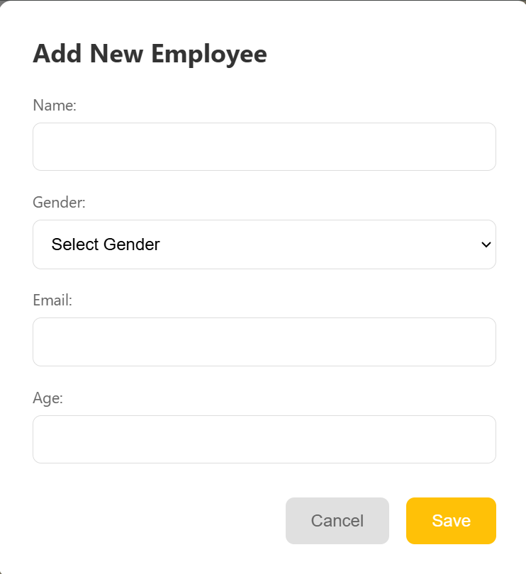

# Employee Section Breakdown

## Employee List View


The main employee management interface with:
- Page title "Employees"
- Yellow "Add Employee" button
- Table containing employee records with columns for:
  - Name (e.g., "Pat Black", "Angel Jones")
  - Gender (Male/Female)
  - Email addresses
  - Age
  - Action buttons (Edit/Delete)

Implementation:
```javascript
// Employee data structure
let employees = [
    { id: 1, name: 'Pat Black', gender: 'Male', email: 'bill.berry@example.com', age: 28 },
    { id: 2, name: 'Angel Jones', gender: 'Female', email: 'glen.ramirez@example.com', age: 36 }
];

// Table rendering function
function renderEmployees(employeesToRender = employees) {
    employeesTableBody.innerHTML = employeesToRender.map(employee => `
        <tr>
            <td>${employee.name}</td>
            <td>${employee.gender}</td>
            <td>${employee.email}</td>
            <td>${employee.age}</td>
            <td>
                <button onclick="editEmployee(${employee.id})" class="edit-btn">
                    <i class="fas fa-edit"></i>
                </button>
                <button onclick="deleteEmployee(${employee.id})" class="delete-btn">
                    <i class="fas fa-trash"></i>
                </button>
            </td>
        </tr>
    `).join('');
}
```

Styling:
```css
.employees-table {
    background-color: white;
    border-radius: 12px;
    box-shadow: 0 4px 12px rgba(0, 0, 0, 0.05);
}

table {
    width: 100%;
    border-collapse: collapse;
}

thead tr {
    background-color: #ffc107;
    color: white;
}

.edit-btn, .delete-btn {
    background: none;
    border: none;
    cursor: pointer;
    padding: 0.5rem;
}
```

Add Employee Modal


The modal contains:
- Title "Add New Employee"
- Form fields:
  - Name (text input)
  - Gender (dropdown)
  - Email (email input)
  - Age (number input)
- Action buttons:
  - Cancel (gray)
  - Save (yellow)

Implementation:
```javascript
const addEmployeeBtn = document.getElementById('addEmployeeBtn');
const modal = document.getElementById('employeeModal');

// Open modal
addEmployeeBtn.addEventListener('click', () => {
    modalTitle.textContent = 'Add New Employee';
    employeeForm.reset();
    modal.style.display = 'block';
});

// Form submission
employeeForm.addEventListener('submit', (e) => {
    e.preventDefault();
    
    const employeeData = {
        name: nameInput.value,
        gender: genderInput.value,
        email: emailInput.value,
        age: parseInt(ageInput.value)
    };

    // Add new employee
    const newId = Math.max(...employees.map(emp => emp.id)) + 1;
    employees.push({ ...employeeData, id: newId });

    modal.style.display = 'none';
    renderEmployees();
});
```

Modal Styling:
```css
.modal {
    position: fixed;
    top: 0;
    left: 0;
    width: 100%;
    height: 100%;
    background-color: rgba(0, 0, 0, 0.5);
    display: flex;
    align-items: center;
    justify-content: center;
}

.modal-content {
    background-color: white;
    padding: 2rem;
    border-radius: 12px;
    width: 90%;
    max-width: 500px;
}

.form-group input,
.form-group select {
    width: 100%;
    padding: 0.8rem;
    border: 1px solid #ddd;
    border-radius: 8px;
}
```
