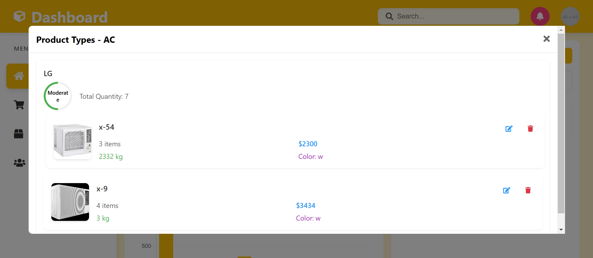

# Homepage Section Image Analysis

## Dashboard Overview


### Visible Components:
1. Navigation Sidebar:
```javascript
// Sidebar toggle functionality
function toggleSidebar() {
    const sidebar = document.querySelector('.sidebar');
    sidebar.classList.toggle('active');
}
```

2. Analytics Cards:
```javascript
// Analytics implementation
const stats = {
    sales: {
        icon: 'chart-line',
        value: '30,000',
        label: "Today's sales",
        trend: 12
    },
    orders: {
        icon: 'shopping-cart',
        value: '270',
        label: "Today's total orders",
        trend: 12
    },
    revenue: {
        icon: 'dollar-sign',
        value: '1,000',
        label: "Today's revenue",
        trend: 12
    },
    customers: {
        icon: 'users',
        value: '100',
        label: "Today's customers",
        trend: 12
    }
};
```

3. Sales Chart:
```javascript
const ctx = document.getElementById('productSalesChart').getContext('2d');
new Chart(ctx, {
    type: 'bar',
    data: {
        labels: ['0', '1', '2', '3', '4', '5', '6', '7', '8', '9', '10'],
        datasets: [{
            label: 'Sales',
            data: [800, 350, 300, 300, 400, 50, 200, 350, 100, 150],
            backgroundColor: '#ffc107',
            borderRadius: 4,
        }]
    },
    options: {
        responsive: true,
        maintainAspectRatio: false
    }
});
```

## Edit Product Modal


Implementation:
```javascript
// Edit modal creation
function editProduct(categoryId, productType, company) {
    const modal = createModal({
        title: "Edit Product Details",
        content: `
            <div class="product-details">
                
                <div class="form-group">
                    <label>Product Name (Read-only)</label>
                    <input type="text" value="${productName}" readonly>
                </div>
                <div class="form-group">
                    <label>Company Name (Read-only)</label>
                    <input type="text" value="${company.name}" readonly>
                </div>
                <div class="form-group">
                    <label>Quantity</label>
                    <input type="number" value="${company.quantity}">
                </div>
            </div>
        `
    });
}

// Stock status visualization
function getStockStatus(quantity) {
    if (quantity <= 3) return 'understock';
    if (quantity >= 10) return 'overstock';
    return 'moderate';
}
```

## Products View Modal


```javascript
function showProductTypes(categoryId) {
    const category = dataManager.getCategory(categoryId);
    const companyGroups = {};
    
    category.productTypes.forEach(type => {
        type.companies.forEach(company => {
            if (!companyGroups[company.name]) {
                companyGroups[company.name] = {
                    name: company.name,
                    products: []
                };
            }
            companyGroups[company.name].products.push({
                name: type.name,
                quantity: company.quantity,
                price: company.price,
                weight: company.weight
            });
        });
    });

    const modalContent = generateModalContent(companyGroups);
    showModal(modalContent);
}
```

## Category Edit Interface


```javascript
function editCategory(categoryId) {
    const modalContent = `
        <div class="edit-category-modal">
            <div class="form-group">
                <label>Product Type Name</label>
                <input type="text" placeholder="New Product Type Name">
            </div>
            <div class="form-group">
                <label>Company Name</label>
                <input type="text" placeholder="Enter company name">
            </div>
            <div class="form-group">
                <label>Quantity</label>
                <input type="number" placeholder="Enter quantity">
            </div>
            <div class="form-group">
                <label>Price ($)</label>
                <input type="number" placeholder="Enter price">
            </div>
            <button class="add-company-btn">Add Company</button>
            <button class="add-product-type-btn">Add Product Type</button>
            <button class="cancel-btn">Cancel</button>
        </div>
    `;
    
    showModal(modalContent);
}
```

## Add Category Interface


```javascript
function handleAddCategory() {
    const form = `
        <div class="add-category-form">
            <input type="text" 
                   placeholder="Enter category name" 
                   class="category-name-input">
            
            <div class="product-types-section">
                <h4>Product Types</h4>
                <div class="image-upload">
                    
                    <button class="upload-btn">Upload Image</button>
                </div>
                <input type="text" 
                       placeholder="Enter company name" 
                       class="company-input">
            </div>
        </div>
    `;

    showModal(form);
}
```
