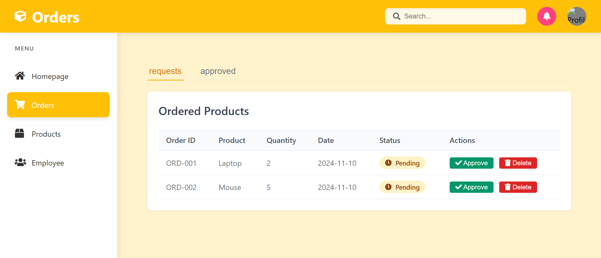
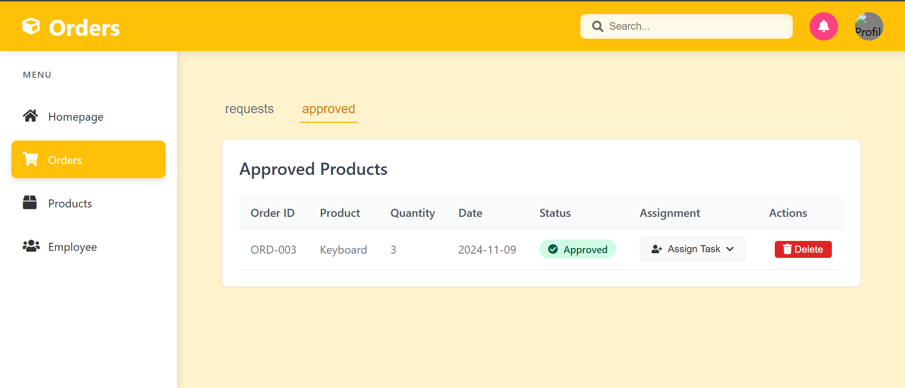

# Orders Section Breakdown

## Approved Orders Tab


### Components Visible:
1. Header section:
- Orders title with cube icon
- Search bar
- Notification/Profile buttons

```javascript
// Header structure
<div class="header">
    <div class="logo">
        <i class="fas fa-cube"></i>
        <h1>Orders</h1>
    </div>
    <div class="header-right">
        <div class="search-bar">
            <input type="text" placeholder="Search...">
        </div>
    </div>
</div>
```

2. Tab System:
```javascript
<div class="tab-navigation">
    <button class="tab-button" data-tab="requests">requests</button>
    <button class="tab-button active" data-tab="approved">approved</button>
</div>

// Tab switching functionality
const tabButtons = document.querySelectorAll('.tab-button');
tabButtons.forEach(button => {
    button.addEventListener('click', () => {
        const tabId = button.getAttribute('data-tab');
        switchTab(tabId);
    });
});
```

3. Approved Orders Table:
```javascript
// Table structure for approved orders
<table class="orders-table">
    <thead>
        <tr>
            <th>Order ID</th>
            <th>Product</th>
            <th>Quantity</th>
            <th>Date</th>
            <th>Status</th>
            <th>Assignment</th>
            <th>Actions</th>
        </tr>
    </thead>
    <tbody>
        <tr>
            <td>ORD-003</td>
            <td>Keyboard</td>
            <td>3</td>
            <td>2024-11-09</td>
            <td><span class="status-badge status-approved">Approved</span></td>
            <td><button class="assign-btn">Assign Task</button></td>
            <td><button class="delete-btn">Delete</button></td>
        </tr>
    </tbody>
</table>
```

## Pending Orders Tab


### Components Visible:
1. Pending Orders Table:
```javascript
// Sample orders data
const orders = [
    {
        id: 'ORD-001',
        product: 'Laptop',
        quantity: 2,
        date: '2024-11-10',
        status: 'Pending'
    },
    {
        id: 'ORD-002',
        product: 'Mouse',
        quantity: 5,
        date: '2024-11-10',
        status: 'Pending'
    }
];

// Table row generation
function createOrderRow(order) {
    return `
        <tr>
            <td>${order.id}</td>
            <td>${order.product}</td>
            <td>${order.quantity}</td>
            <td>${order.date}</td>
            <td>
                <span class="status-badge status-pending">
                    <i class="fas fa-clock"></i>
                    ${order.status}
                </span>
            </td>
            <td>
                <button class="action-button approve-button">
                    <i class="fas fa-check"></i> Approve
                </button>
                <button class="action-button delete-button">
                    <i class="fas fa-trash"></i> Delete
                </button>
            </td>
        </tr>
    `;
}
```

2. Action Buttons:
```javascript
// Action button handlers
function addButtonEventListeners() {
    document.querySelectorAll('.approve-button').forEach(button => {
        button.addEventListener('click', (e) => {
            const orderId = e.target.getAttribute('data-id');
            approveOrder(orderId);
        });
    });

    document.querySelectorAll('.delete-button').forEach(button => {
        button.addEventListener('click', (e) => {
            const orderId = e.target.getAttribute('data-id');
            if (confirm('Are you sure you want to delete this order?')) {
                deleteOrder(orderId);
            }
        });
    });
}
```

Relevant CSS for both views:
```css
.status-badge {
    padding: 0.25rem 0.75rem;
    border-radius: 9999px;
    font-weight: 500;
    display: inline-flex;
    align-items: center;
    gap: 0.5rem;
}

.status-pending {
    background-color: #fef3c7;
    color: #92400e;
}

.status-approved {
    background-color: #d1fae5;
    color: #065f46;
}

.action-button {
    padding: 0.25rem 0.75rem;
    border-radius: 0.25rem;
    cursor: pointer;
}

.approve-button {
    background-color: #059669;
    color: white;
}

.delete-button {
    background-color: #dc2626;
    color: white;
    margin-left: 0.5rem;
}
```
