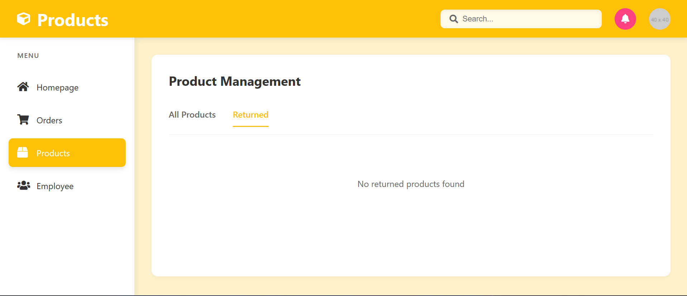
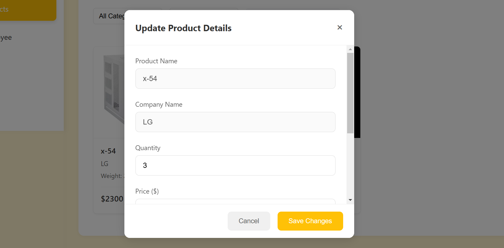
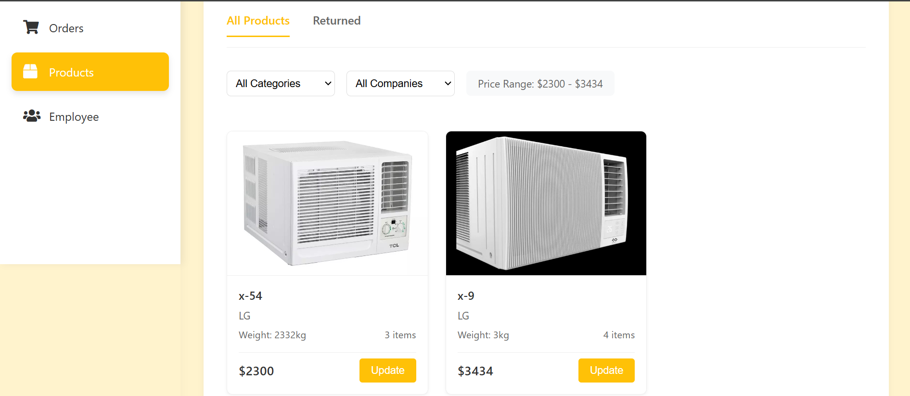

# Product Section Visual Breakdown

## Product Management Header


Components displayed:
- Product section header with logo
- Tab navigation (All Products/Returned)
- Empty state message for returned products

Implementation:
```javascript
// Tab system initialization
document.addEventListener('DOMContentLoaded', function() {
    const tabs = document.querySelectorAll('.tab');
    tabs.forEach(tab => {
        tab.addEventListener('click', switchTab);
    });
});

// Returned products display
function loadReturnedProducts() {
    const returnedPane = document.getElementById('returned-products');
    returnedPane.innerHTML = `
        <div class="empty-message">
            <p>No returned products found</p>
        </div>
    `;
}
```

## Product Update Modal


Components displayed:
- Modal header with close button
- Read-only fields (Product Name, Company Name)
- Editable fields (Quantity, Price)
- Action buttons (Cancel, Save Changes)

Implementation:
```javascript
function editProduct(categoryId, companyName, productName) {
    const editModal = document.createElement('div');
    editModal.className = 'modal';
    editModal.innerHTML = `
        <div class="modal-content">
            <div class="modal-header">
                <h3>Update Product Details</h3>
                <button class="close-btn">×</button>
            </div>
            <div class="modal-body">
                <input type="text" value="${productName}" readonly>
                <input type="text" value="${companyName}" readonly>
                <input type="number" id="edit-quantity" value="3">
                <input type="number" id="edit-price">
            </div>
            <div class="form-actions">
                <button class="btn-secondary">Cancel</button>
                <button class="btn-primary">Save Changes</button>
            </div>
        </div>
    `;
}
```

## Product Grid View


Components displayed:
- Filter dropdowns (Categories, Companies)
- Price range display
- Product cards with:
  - Product images
  - Model numbers (x-54, x-9)
  - Company names
  - Weight specifications
  - Prices
  - Update buttons

Implementation:
```javascript
function loadAllProducts() {
    const productsHTML = `
        <div class="filter-options">
            <select class="category-filter">
                <option value="">All Categories</option>
                ${generateCategoryOptions()}
            </select>
            <select class="company-filter">
                <option value="">All Companies</option>
                ${generateCompanyOptions()}
            </select>
            <span class="price-range">Price Range: $2300 - $3434</span>
        </div>
        <div class="products-grid">
            ${products.map(product => `
                <div class="product-card">
                    
                    <div class="product-info">
                        <h3>${product.name}</h3>
                        <p>${product.company}</p>
                        <p>Weight: ${product.weight}kg</p>
                        <p>Items: ${product.quantity}</p>
                        <div class="price-section">
                            <span>$${product.price}</span>
                            <button class="update-btn">Update</button>
                        </div>
                    </div>
                </div>
            `).join('')}
        </div>
    `;
    
    document.getElementById('all-products').innerHTML = productsHTML;
}

// Filter functionality
function setupFilters() {
    const filters = document.querySelectorAll('select');
    filters.forEach(filter => {
        filter.addEventListener('change', () => {
            applyFilters();
        });
    });
}
```

